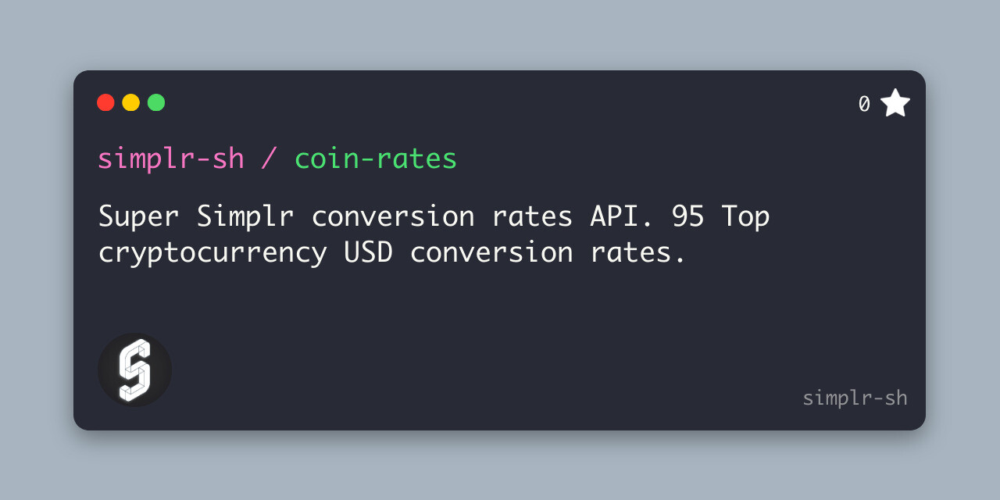

<div align="center">
    
    <h1 align="center">
      <a href="https://github.com/simplr-sh/coin-rates">
        Coin Rates
      </a>
    </span>
</div>


### Super Simplr conversion rates API. 95 Top cryptocurrency USD conversion rates. No bandwidth or request limits. Completely free & open source for all to use. 30 seconds between updates per token.





## API Endpoints

### Get All Available Tokens

Retrieve a list of all supported cryptocurrency tokens.

**JSON Format:**
```
GET https://coin-rates.simplr.sh/api/tokens.json
```

**CSV Format:**
```
GET https://coin-rates.simplr.sh/api/tokens.csv
```

Returns a list of tokens with their ID, name, and symbol. Example response (JSON):
```json
[
  {
    "id": "bitcoin",
    "name": "Bitcoin",
    "symbol": "BTC"
  },
  {
    "id": "ethereum",
    "name": "Ethereum",
    "symbol": "ETH"
  }
  // ... more tokens
]
```

Use these token IDs to query individual token rates.

### Get Token Exchange Rate

Get the current USD exchange rate for a specific cryptocurrency token.

```
GET https://coin-rates.simplr.sh/api/rates/{id}
```

- `{id}`: The token ID from the tokens list (e.g., "bitcoin", "ethereum")
- Updates every 30 seconds
- Returns the current USD exchange rate

Example Request:
```
GET https://coin-rates.simplr.sh/api/rates/bitcoin
```

Example Response:
```json
{
  "btc": {
    "usd": 42789.65
  }
}
```

Error Response (Invalid Token ID):
```json
{
  "error": "Invalid token id"
}
```

#### Rate Limits
- No request limits
- No bandwidth limits
- 30-second cache per token
- Free for all usage

## Development

### Prerequisites
- Node.js 18+ installed
- Wrangler CLI installed (`npm install -g wrangler`)
- Cloudflare account (for deployment)

### Local Development
1. Clone the repository:
```bash
git clone https://github.com/simplr-sh/coin-rates.git
cd coin-rates
```

2. Install dependencies:
```bash
npm install
```

3. Start the development server:
```bash
npm run dev
```

The API will be available at `http://localhost:8787`.

## Deployment

### Deploy to Cloudflare Workers

1. Login to Cloudflare (if not already):
```bash
wrangler login
```

2. Deploy to Cloudflare Workers:
```bash
npm run deploy
```

Your API will be deployed to `https://<your-worker>.workers.dev`.

### Environment Variables
No environment variables required for basic setup.

### Notes
- Updates automatically every 30 seconds
- Uses Cloudflare's edge network for global distribution
- Zero configuration required